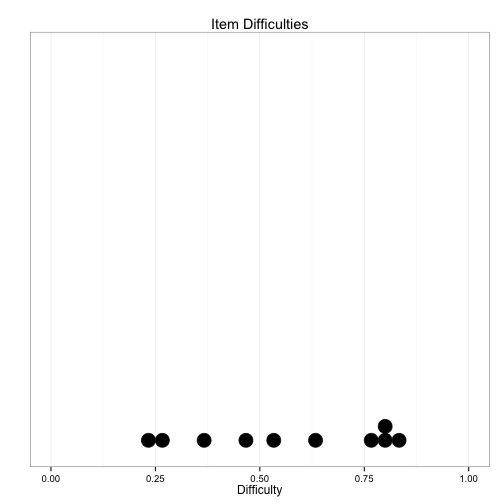

**Number of items:** 10

**Number of examinees:** 30


## Total score information


|                   | Value |
|:------------------|:-----:|
|Minimum Score      | 1.00  |
|Maximum Score      | 9.00  |
|Mean Score         | 5.70  |
|Median Score       | 6.00  |
|Standard Deviation | 2.05  |
|IQR                | 2.75  |
|Skewness (G1)      | -0.26 |
|Kurtosis (G2)      | -0.31 |


## Reliability


```
## Error in names(rels) = c("", "Estimate", "95%LL", "95%UL", "SEM"): 'names' attribute [5] must be the same length as the vector [4]
```

```
## Error in `colnames<-`(`*tmp*`, value = c(" ", "Estimate", "X95..LL", "X95..UL", : attempt to set 'colnames' on an object with less than two dimensions
```


|       | Alpha (if Item Deleted)|
|:------|-----------------------:|
|item1  |                    0.54|
|item2  |                    0.58|
|item3  |                    0.53|
|item4  |                    0.50|
|item5  |                    0.57|
|item6  |                    0.55|
|item7  |                    0.50|
|item8  |                    0.59|
|item9  |                    0.57|
|item10 |                    0.51|

## Item overview


|       | Difficulty| PBiS| Corrected PBiS| Missing (N)| Missing (p)|
|:------|----------:|----:|--------------:|-----------:|-----------:|
|item1  |       0.23| 0.47|           0.29|           0|        0.00|
|item2  |       0.27| 0.35|           0.14|           0|        0.00|
|item3  |       0.53| 0.52|           0.31|           2|        0.07|
|item4  |       0.63| 0.61|           0.42|           0|        0.00|
|item5  |       0.80| 0.34|           0.15|           1|        0.03|
|item6  |       0.80| 0.42|           0.24|           0|        0.00|
|item7  |       0.47| 0.60|           0.41|           2|        0.07|
|item8  |       0.37| 0.32|           0.08|           1|        0.03|
|item9  |       0.77| 0.35|           0.15|           0|        0.00|
|item10 |       0.83| 0.55|           0.41|           0|        0.00|

 


## Item details


```
## [[1]]
## [[1]]$`Dist_diff of Item1`
## 
##         A         D         E 
## 0.3000000 0.4666667 0.2333333 
## 
## [[1]]$`Dist_diff of Item2`
## 
##          A          B          C          D          E 
## 0.46666667 0.26666667 0.10000000 0.06666667 0.10000000 
## 
## [[1]]$`Dist_diff of Item3`
## 
##                     A          B          C          D          E 
## 0.06666667 0.06666667 0.06666667 0.53333333 0.06666667 0.20000000 
## 
## [[1]]$`Dist_diff of Item4`
## 
##         C         D         E 
## 0.1333333 0.6333333 0.2333333 
## 
## [[1]]$`Dist_diff of Item5`
## 
##                     B          C 
## 0.03333333 0.80000000 0.16666667 
## 
## [[1]]$`Dist_diff of Item6`
## 
##   A   B   C 
## 0.1 0.1 0.8 
## 
## [[1]]$`Dist_diff of Item7`
## 
##                     A          B          C          D          E 
## 0.06666667 0.46666667 0.16666667 0.10000000 0.06666667 0.13333333 
## 
## [[1]]$`Dist_diff of Item8`
## 
##                     A          B          C          D          E 
## 0.03333333 0.03333333 0.36666667 0.16666667 0.16666667 0.23333333 
## 
## [[1]]$`Dist_diff of Item9`
## 
##          A          B          C          D          E 
## 0.06666667 0.03333333 0.76666667 0.10000000 0.03333333 
## 
## [[1]]$`Dist_diff of Item10`
## 
##          A          B          C          D 
## 0.83333333 0.10000000 0.03333333 0.03333333 
## 
## 
## [[2]]
## [[2]]$`Dist_disc of Item1`
## [1] -0.20367271 -0.05516619  0.28574430
## 
## [[2]]$`Dist_disc of Item2`
## [1] -0.17730315  0.13949107  0.04073556 -0.06065634  0.09892921
## 
## [[2]]$`Dist_disc of Item3`
## [1]  0.04924854  0.04924854 -0.46786110  0.30780336 -0.02462427 -0.13820336
## 
## [[2]]$`Dist_disc of Item4`
## [1] -0.4028316  0.4197265 -0.1544557
## 
## [[2]]$`Dist_disc of Item5`
## [1] -0.08700222  0.14749744 -0.11640505
## 
## [[2]]$`Dist_disc of Item6`
## [1] -0.27690689 -0.04124145  0.23861126
## 
## [[2]]$`Dist_disc of Item7`
## [1]  0.04039889  0.40651381 -0.21125084 -0.23303648 -0.03534903 -0.16304574
## 
## [[2]]$`Dist_disc of Item8`
## [1]  0.16113948 -0.03222790  0.08403416 -0.07761505  0.20179914 -0.25987926
## 
## [[2]]$`Dist_disc of Item9`
## [1] -0.270004109 -0.187601105  0.145512173  0.127734386  0.006469004
## 
## [[2]]$`Dist_disc of Item10`
## [1]  0.40528700 -0.21749983 -0.39042414 -0.08750886
```


