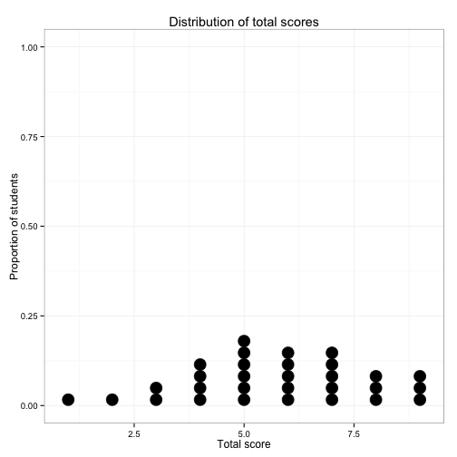

**Number of items:** 10

**Number of examinees:** 30


## Total score information

 


## Reliability


```
##                   Estimate  95% LL    95% UL    SEM     
## Coefficient Alpha 0.5729687 0.3025713 0.7678174 1.341974
## Guttman's L2      0.6085092 0.3606162 0.7871412 1.284917
## Guttman's L4      0.5363859 0.2428242 0.7479268 1.398275
## Feldt-Gilmer      0.5910053 0.3320287 0.7776241 1.313328
## Feldt-Brennan     0.5784015 0.3114441 0.7707713 1.33341
```

```
##     item1     item2     item3     item4     item5     item6     item7 
## 0.5393041 0.5760439 0.5317487 0.4985795 0.5718157 0.5510778 0.5012496 
##     item8     item9    item10 
## 0.5936747 0.5734223 0.5144547
```

*Brief notes about reliability assumptions here.*

## Item overview


|       | Difficulty| PBiS| Corrected PBiS| Missing (N)| Missing (p)|
|:------|----------:|----:|--------------:|-----------:|-----------:|
|item1  |       0.23| 0.47|           0.29|           0|        0.00|
|item2  |       0.27| 0.35|           0.14|           0|        0.00|
|item3  |       0.53| 0.52|           0.31|           2|        0.07|
|item4  |       0.63| 0.61|           0.42|           0|        0.00|
|item5  |       0.80| 0.34|           0.15|           1|        0.03|
|item6  |       0.80| 0.42|           0.24|           0|        0.00|
|item7  |       0.47| 0.60|           0.41|           2|        0.07|
|item8  |       0.37| 0.32|           0.08|           1|        0.03|
|item9  |       0.77| 0.35|           0.15|           0|        0.00|
|item10 |       0.83| 0.55|           0.41|           0|        0.00|


```
## Error in as.data.frame(mybasics): object 'mybasics' not found
```

```
## Error in rownames(basicdf): object 'basicdf' not found
```

```
## Error in findInterval(basicdf$difficulty, (0:10)/10): object 'basicdf' not found
```

```
## Error in ggplot(basicdf, aes(difficultybin, y = 1, label = item)): object 'basicdf' not found
```


## Item details


### Item 1
Domain: `XX`


```
## Error in getTerciles(x): object 'scores' not found
```

```
## Error in eval(expr, envir, enclos): could not find function "item_names"
```

```
## Error in eval(expr, envir, enclos): object 'tercsummary' not found
```

```
## Error in eval(expr, envir, enclos): could not find function "%>%"
```

```
## Error in rbind(this, fillzeros %>% anti_join(this, by = c("item", "tercile", : object 'this' not found
```

```
## Error in ggplot(thisfull, aes(x = tercile, y = prop, group = response, : object 'thisfull' not found
```

*(these numbers are made up, the package does not yet easily provide the correlation with corrected total or more sophisticated keys)*

| Choice | Key | Proportion | Cor w/ Corrected Total| 
|---:|----:|----:|----:|
|A|0|0.3|-.2|
|D|0|0.47|.02|
|E|1|0.3|.3|

`XX` missing values out of `XX` examinees (`XX` %).

### Item 2
... and so on


